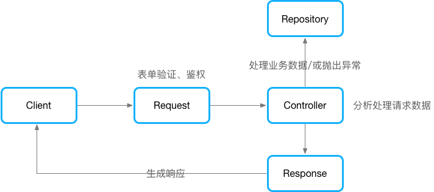

## 项目开发文档

- [目录结构](#目录结构)
- [如何开始开发一个新功能](#如何开始开发一个新功能)
- [搜索及高级搜索](./搜索及高级搜索.md)
- [权限与策略](./权限与策略.md)
- [前端路由管理](./前端路由管理.md)


## 目录结构

```
├── app  #应用程序的核心代码，此目录遵循 PSR-4 加载标准
│   ├── Console  #所有自定义的 Artisan 命令
│   ├── Contracts  #自定义的契约（接口）
│   ├── Enums  #常量类
│   ├── Events  #事件类
│   ├── Exceptions  #异常处理类
│   ├── helpers.php  #公用的助手函数
│   ├── Http  #应用的请求的处理逻辑都被放在这里
│   │   ├── Controllers  #控制器
│   │   ├── Kernel.php
│   │   ├── Middleware  #中间件
│   │   ├── Requests  #http请求验证
│   │   └── Resources #API资源类
│   ├── Libraries  #第三方库
│   ├── Listeners  #监听器
│   ├── Mail  #邮件发送
│   ├── MediaLibrary  #媒体资源
│   ├── Models  #模型
│   ├── Netsuite  #NS模块
│   ├── Observers  #模型观察者
│   ├── ProjectManage  #项目研发管理工具模块
│   ├── Providers  #服务提供者
│   ├── Repositories  #Repository 类
│   ├── Rpc  #RPC请求、发布服务
│   ├── Support
│   └── Traits
├── artisan
├── bootstrap  #框架启动
├── composer.json
├── composer.lock
├── config  #包含应用程序所有的配置文件
│   ├── app.php
│   ├── auth.php
│   ├── broadcasting.php
│   ├── cache.php
│   ├── cors.php
│   ├── database.php
│   ├── filesystems.php
│   ├── hashing.php
│   ├── jwt.php
│   ├── logging.php
│   ├── mail.php
│   ├── medialibrary.php
│   ├── netsuite.php
│   ├── permission.php
│   ├── query-builder.php
│   ├── queue.php
│   ├── services.php
│   ├── session.php
│   └── view.php
├── data  #需要持久化的数据
│   ├── permission  #权限数据
│   ├── position  #职称数据
│   └── subsystem  #子系统数据
├── database  #数据库相关
│   ├── factories  #模型工厂类
│   ├── migrations  #数据表迁移文件
│   └── seeds  #数据填充
├── doc  #项目开发文档
├── package.json
├── phpunit.xml  #phpunit 配置文件
├── public
├── readme.md
├── resources #包含了视图和未编译的资源文件
│   ├── js
│   ├── lang  #语言包文件
│   ├── sass
│   └── views #视图文件
├── routes  #包含了应用的所有路由定义
│   ├── api.php
│   ├── channels.php
│   ├── console.php
│   └── web.php
├── sdk  #第三方 sdk
├── server.php
├── storage  #包含编译后的 Blade 模板、日志文件、缓存文件以及框架生成的其他文件
├── tests  #包含自动化测试文件
│   ├── CreatesApplication.php
│   ├── EndTest.php
│   ├── Feature  #功能测试（API接口测试）
│   ├── TestCase.php
│   └── Unit #单元测试
├── vendor  #所有的 Composer 依赖包
└── webpack.mix.js
```
如你所见，这是一个常规的 Laravel 项目，更多更详细的内容请参考官方文档 https://learnku.com/docs/laravel/5.8/structure/3881 。

## 如何开始开发一个新功能
这个类要写到哪儿？这是一个在写代码时十分常见的问题，然而维护一个大型项目并不容易，因此有一个良好的项目结构会是一个很好的开始。



**核心思想就是分层**。为了避免控制器无限膨胀，为了提高代码的复用率，我们推荐使用 Repository 模式。在 Request 中做表单验证、鉴权（策略）；在控制器中处理请求数据、调用对应 Repository、返回最终的“成果”；在 Repository 中做任何业务逻辑处理。

事实上，一个大型项目往往包含的功能模块会很多，为了使项目结构更清晰明了，我们需要借助“模块化”思想。我们将要在`app`目录下创建个新的目录，目录名就以我们这个功能的名字来命名，比如我们开发的功能是项目研发管理工具，就叫`ProjectManage`吧。这样我们现在有了个`app/ProjectManage`目录，在这个目录下我们需要建立`Models`、`Repositories`等目录。还记得吗，`app`目录遵循 PSR-4 自动加载标准，你可以在这个目录下做任何事。

记住，如果你在写一个很小的功能，那在`app/Models`、`app/Repositories`目录下添加几个类其实也挺合适的。请注意使用场景。

优化应用的设计结构的关键就是责任划分，或者说是创建不同的责任层次。控制器只负责接收和响应HTTP请求然后调用合适的业务逻辑层的类。你的业务逻辑才是你真正的程序。做出好的设计的确很有挑战性，但好的设计也会带来可持续发展的清晰的好代码。

强烈推荐去看看 Laravel 作者 Taylor Otwell 写的[《From Apprentice To Artisan》](https://my.oschina.net/zgldh/blog/362063#OSC_h1_1)这本书。

## 项目模块说明
//todo
